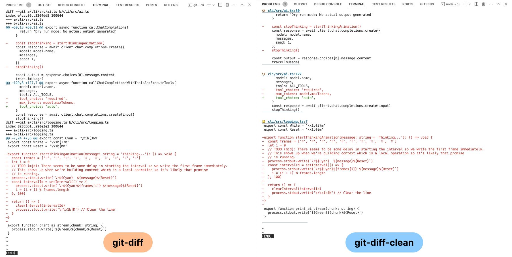

# git-diff-clean

Cleaner git-diff output for terminal and as node library.



- Link to changes via cmd+click
- Emoji to visuall group changes in the same file
- Stipped down output

## Terminal usage

```
> npx git-diff-clean -h
Options:
      --version           Show version number                          [boolean]
  -p, --includePlusMinus  Include plus/minus signs in the diff output
                                                       [boolean] [default: true]
  -c, --includeColors     Include colors in the diff output
                                                       [boolean] [default: true]
  -e, --includeEmoji      Include emojis next to file names to visually group
                          them.                        [boolean] [default: true]
  -f, --includeFooter     Include a line as a footer to close out the diff
                          output                       [boolean] [default: true]
  -l, --useLess          Use less as the pager to view output     [boolean] [default: true]
  -h, --help              Show help                                    [boolean]
```

And if you like it `alias d="npx git-diff-clean"`

## Library usage

```
export type DiffOptions = {
  /* Include plus/minus signs in the diff output */
  includePlusMinus: boolean
  /* Include colors in the diff output */
  includeColors: boolean
  /* Include emojis next to file names to visually group them. */
  includeEmoji: boolean
  /* Include a line as a footer to close out the diff output */
  includeFooter: boolean
}

/**
 * Get the current git diff as a string.
 *
 * @param options [DiffOptions] - Options for the diff output.
 * @returns [String] git diff string
 */
export function getDiff(options: DiffOptions): string { .. }
/**
 * Open the current git diff in less.
 *
 * @param options [DiffOptions] - Options for the diff output.
 */
function showDiff(options: DiffOptions, useLess: boolean = true) { .. }
```

## Why I built this library

I'm building a personal AI coding assistant that often edits multiple files. I found `git-diff` is a good way
to review those changes but it was a little limited. The two capabilities I wanted are (1) make it a bit easier
to read and (2) provide a link in VSCode terminal I can click to go directly to the edit.
